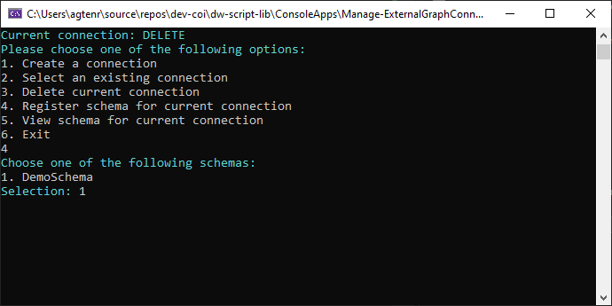

# Manage-ExternalGraphConnector

## SYNOPSIS
This console application can help you in managing custom connectors for the Microsoft Graph API.
It connects to the Graph API and can handle the following commands:
1. View all registered connectors
2. View the search schema of all registered connectors
3. Create a new external connector
4. Delete an external connector
5. Register a search schema for an existing connector

## SOURCE
https://github.com/dlw-digitalworkplace/dw-script-lib/tree/main/ConsoleApps/Manage-ExternalGraphConnector.

The code is also partly based on the PartsInventoryConnector sample:
https://github.com/microsoftgraph/msgraph-search-connector-sample/tree/main/PartsInventoryConnector

## AUTHOR
 - Name: Robin Agten
 - Email: robin.agten@delaware.pro

## Prerequisites
 - The code uses .NET Core 7 so this must be installen
 - A valid app registration (client id, client secret) with the following applicatoin permissions:
   - ExternalConnection.ReadWrite.All
   - ExternalItem.ReadWrite.All

## Running the console app

### Running in visual studio
1. Open Visual Studio Solution
2. Update the user secrets of the project (see the `secrets_sample.json` file)
3. Run the console application
### Running in the command line
It is also possible to run it via the command line. 
```powershell
.\Imec.WhoIsWho.ConnectorSetup.exe -s "CLIENT_SECRET" -c "CLIENT_ID" -t "TENANT_ID"
```

## Screenshots





## Tags
 * Microsoft Graph
 * External Connector