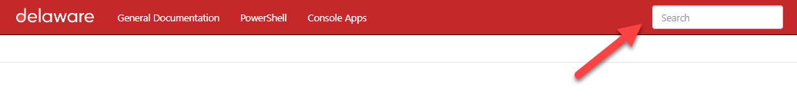

# DW Script Lib.
Welcome to the `dw-script-lib` documentation page. This library is intented to have one centralized location of all PowerShell scripts and Console applications that are reusable. Here you will find all relevant information regarding the script (how to use them, how to contribute, ...).

## General information
The general information page will give you all the details you need about this library. Do you want to contribute to the library? Do you have a script that you think might be usefull? do you see additions to the framework itself? All these question will be handled there

## PowerShell
The PowerShell section is the place-to-be for all Microfoft relates PowerShell script. All the scripts are listed with all the needed information like prerequisites, technology and even examples

## Console Applications
Do you think PowerShell will not solve your problem and that you will need some C# magic, definately check out the Console Apps sections. Here you will find small console applications that interact with Miscrosoft systems with documentation and examples

## Search
Not sure what you are looking for? Just use the search box in the upper right corner and see what you can find 😊.

## Issues
If you encounter any kind of issues with this library, feel free to log an issue on [GitHub](https://github.com/dlw-digitalworkplace/dw-script-lib)
